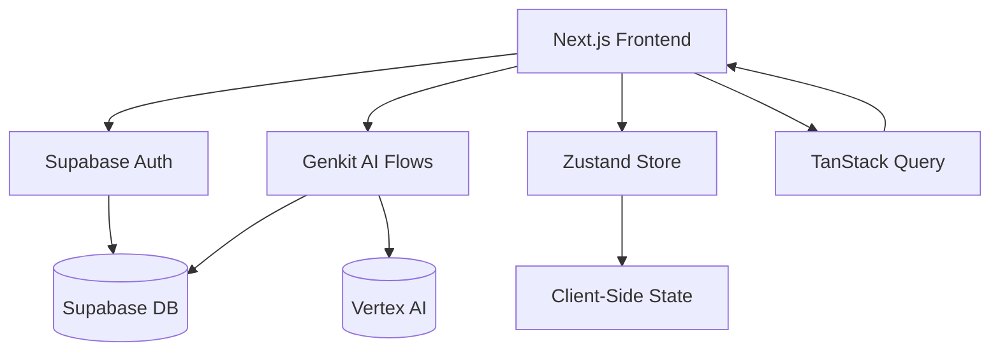
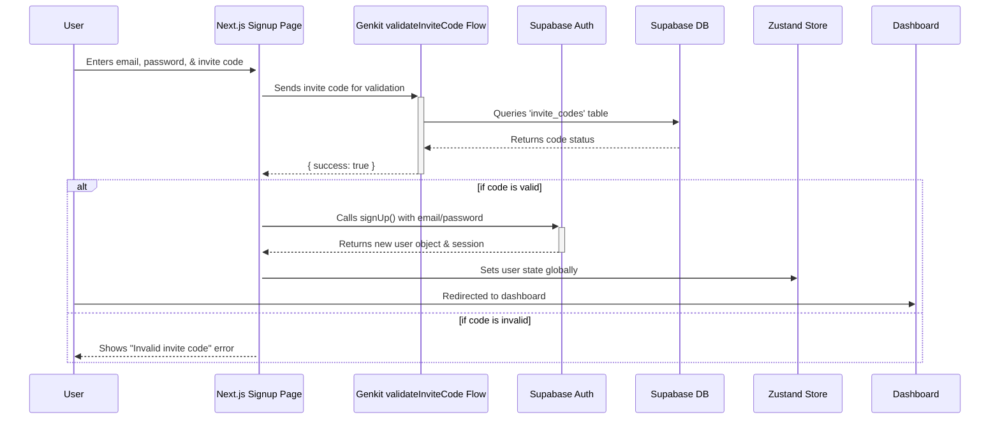

# ElmiClan Portal Technical Specification

## 1. System Overview
This document provides a technical overview of the ElmiClan Portal, detailing its architecture, core components, and key implementation patterns.



## 2. Core Architecture

### 2.1 Frontend
- **Framework**: Next.js (App Router)
- **Language**: TypeScript
- **UI Components**: `shadcn/ui` - A collection of reusable, accessible, and composable React components.
- **Styling**: Tailwind CSS for utility-first styling, with global styles defined in `src/app/globals.css`.
- **Animation**: `framer-motion` for page transitions and micro-interactions, wrapped in the `src/components/AnimatedPage.tsx` component.

### 2.2 Backend & Database
- **Backend-as-a-Service (BaaS)**: Supabase is used for authentication, database, and storage.
  - **Authentication**: `supabase-js` handles user login, signup, and session management.
  - **Database**: Supabase Postgres is the primary database for storing user data, invite codes, and other application data.
- **AI Flows**: Google's Genkit is used to create secure, server-side AI and business logic flows.
  - **Provider**: `google-ai` plugin connects to Vertex AI for generative AI capabilities.
  - **Deployment**: Genkit flows are deployed as serverless functions, accessible to the frontend via a generated client.

### 2.3 State Management
- **Client-Side State**: **Zustand** (`src/store/userStore.ts`) is used for minimal, global state management, primarily for storing the authenticated user's session and profile information.
- **Server-State & Caching**: **TanStack Query (React Query)** is used for fetching, caching, and managing server state. Custom hooks like `use-missions.ts` abstract the data-fetching logic.

## 3. Key Flows & Logic

### 3.1 Authentication & Signup Flow
The signup process is secured by a server-side Genkit flow that validates an invite code before a user can be created in Supabase.



### 3.2 Secure Messaging (Matrix Protocol)
End-to-end encrypted (E2EE) messaging is handled by server-side Genkit flows that interact with a Matrix homeserver. This keeps all credentials and sensitive logic off the client.

- **`src/ai/matrix-client.ts`**: A singleton module to manage the Matrix client instance, ensuring a persistent connection.
- **`src/ai/flows/send-secure-message.ts`**: A Genkit flow that takes a message from the frontend and relays it to the Matrix room.
- **`src/ai/flows/fetch-messages.ts`**: A Genkit flow that fetches the latest messages from the Matrix room.

### 3.3 AI-Powered Rank Advisor
The Rank Advisor is a Genkit flow that uses a generative model to provide personalized advice.

```typescript
// src/ai/flows/rank-advisor.ts
export const rankAdvisorFlow = createFlow(
  {
    name: 'rankAdvisor',
    inputSchema: z.object({ userId: z.string() }),
    outputSchema: z.string(),
  },
  async ({ userId }) => {
    // 1. Fetch user data from Supabase
    const user = await getUserFromDb(userId);

    // 2. Construct a prompt for the AI model
    const prompt = `Generate career advice for a user with rank: ${user.rank}.`;

    // 3. Call the AI model via Genkit
    const response = await ai.generate({ prompt });
    return response.text();
  }
);
```

## 4. Access Control & Permissions
The application uses a role-based access control (RBAC) system based on user "rank".

- **`src/lib/permissions.ts`**: Defines permission sets using **CASL (`@casl/ability`)**. The `defineRulesFor` function creates an `AppAbility` object based on the user's rank.
- **`src/lib/types.ts`**: Defines the `Ranks` enum and the `rankHierarchy` object, which assigns a numerical level to each rank for easy comparison.
- **UI-Level Control**: Components check permissions using the CASL ability object to conditionally render UI elements.
- **Route Protection**: `src/middleware.ts` can be used to protect routes based on authentication status and, if needed, user rank.

```typescript
// src/lib/permissions.ts
import { defineAbility } from '@casl/ability';
import { Ranks } from './types';

export function defineRulesFor(rank: Ranks) {
  const { can, cannot } = new AbilityBuilder(AppAbility);

  if (rank >= Ranks.SCOUT) {
    can('read', 'missions');
  }
  if (rank >= Ranks.ADMIN) {
    can('manage', 'all'); // Admins can do anything
  }

  return build();
}
```

## 5. Deployment & CI/CD
- **Hosting**: The application is configured for deployment on Google App Hosting, as defined in `apphosting.yaml`.
- **CI/CD**: A GitHub Actions workflow in `.github/workflows/deploy.yml` automates the process of building and deploying the application to the hosting environment whenever code is pushed to the `main` branch.
- **Environment Variables**: A combination of `.env` files and `src/env.mjs` (using T3 Env) ensures that all required environment variables are present and correctly typed at runtime.
