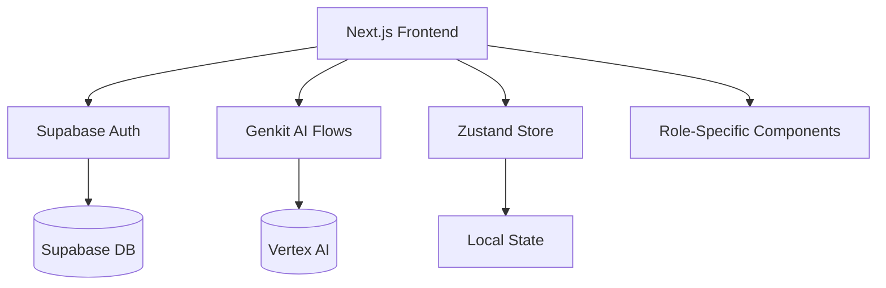
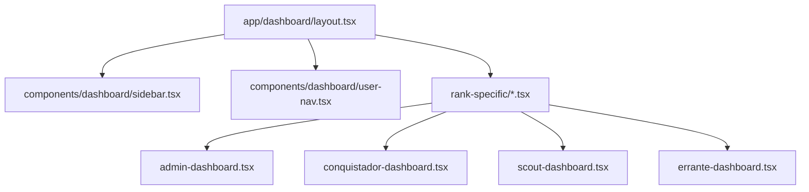
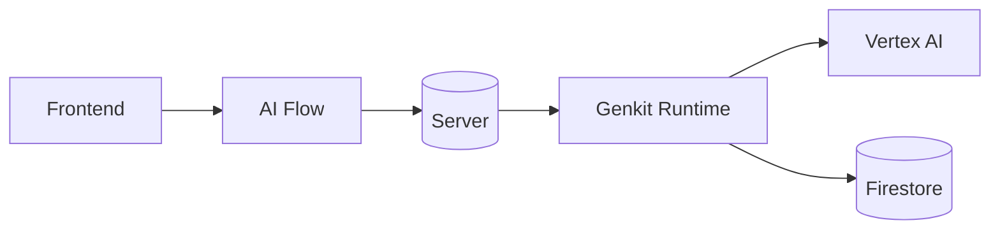
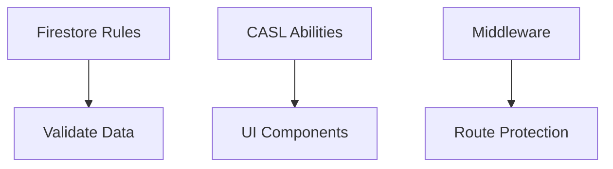
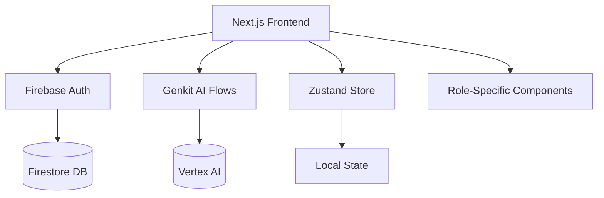
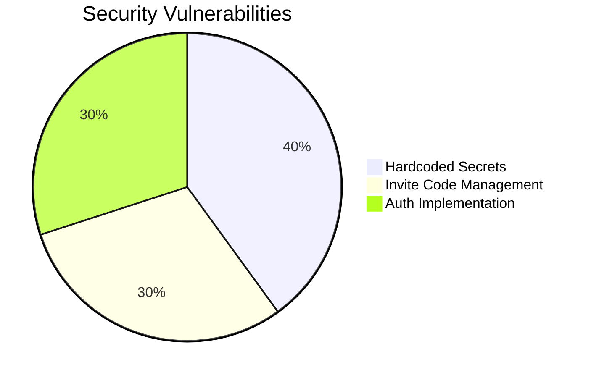
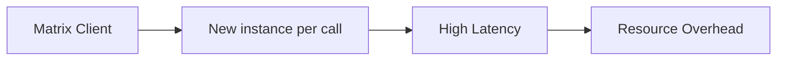

# ElmiClan Portal Technical Specification

## 1. System Overview


## 2. Core Architecture
### 2.1 Critical Paths
- **Authentication Flow**:
  ```mermaid
  sequenceDiagram
      User->>+Signup Page: Submit credentials & invite code
      Signup Page->>+validateInviteCode Flow: Check code against Firestore
      validateInviteCode Flow-->>-Signup Page: Validation result
      alt Invite code is valid
          Signup Page->>+Supabase Auth: Create user
          Supabase Auth-->>-Signup Page: User object
          Signup Page->>Zustand Store: Persist session & user data
      end
  ```

### 2.2 State Management
**Zustand Store** (`src/store/userStore.ts`):
The global Zustand store holds client-side state like user rank and permissions. Authentication state is managed via `src/hooks/use-supabase-auth.tsx`, which interacts with Supabase and syncs the user object to the Zustand store.
```typescript
interface UserState {
  user: User | null;
  rank: Ranks;
  permissions: AppAbility;
  setUser: (user: User | null) => void;
}
```

### 2.3 Component Architecture


## 3. AI Integration Patterns
### 3.1 Genkit Flow Architecture


### 3.2 Key Flows
**Validate Invite Code Flow**:
```typescript
export const validateInviteCodeFlow = createFlow(
  { name: 'validateInviteCode' },
  async (code: string) => {
    // Logic to query Firestore 'inviteCodes' collection
    // and verify if the code is valid.
    // Returns { success: boolean, error?: string }
  }
)
```

## 4. Permission System
### 4.1 CASL Ability Definitions
```typescript
export function defineRulesFor(rank: Ranks) {
  return defineAbility((can) => {
    if (rank >= Ranks.SCOUT) {
      can('manage', 'Missions');
    }
  });
}
```

### 4.2 Security Layers


## 5. Implementation Summary & Refinements

This section summarizes the major implementation improvements and security enhancements that have been completed.

| Category      | Improvement                                                              | Status    |
|---------------|--------------------------------------------------------------------------|-----------|
| Security      | Moved secrets to environment variables                                   | Completed |
| Security      | Migrated invite codes to Firestore with server-side validation           | Completed |
| Security      | Migrated authentication to Supabase                                      | Completed |
| Performance   | Implemented Matrix client singleton                                      | Completed |
| Code Quality  | Standardized Genkit flow error handling                                  | Completed |
| Code Quality  | Replaced mock data with database integration                             | Completed |


## 6. Future Roadmap
1. **TTS Integration**:
   - Self-hosted eSpeak server implementation
   - Audio message encryption

2. **Performance Optimization**:
   - Dynamic imports for components
   - Matrix client singleton pattern

3. **Security Enhancements**:
   - Environment variable validation
   - Secret rotation automation

4. **State Management**:
   - Zustand middleware for error handling
   - TanStack Query cache invalidation strategies

5. **UI/UX**:
   - Accessibility audit
   - Mobile responsiveness improvements
   - Theming and customization options


## 2. Core Architecture
### 2.1 Critical Paths
- **Authentication Flow**:
  ```mermaid
  sequenceDiagram
      User->>+Signup Page: Submit credentials
      Signup Page->>+Validate Invite Flow: Check code
      Validate Invite Flow-->>-Signup Page: Validation result
      Signup Page->>+Firebase: Create user
      Firebase-->>-Signup Page: User object
      Signup Page->>Zustand Store: Persist session
  ```

### 2.2 State Management
**Zustand Store** (`src/store/userStore.ts`):
```typescript
interface UserState {
  user: User | null;
  rank: Ranks;
  permissions: AppAbility;
  setUser: (user: User | null) => void;
}
```

### 2.3 Component Architecture


## 3. AI Integration Patterns
### 3.1 Genkit Flow Architecture


### 3.2 Key Flows
**Rank Advisor Flow**:
```typescript
export const flow = createFlow(
  { name: 'rankAdvisor', authPolicy: 'user' },
  async ({ userId }) => {
    const userData = await getUserData(userId);
    return ai.generate(`Advice for ${userData.rank} rank`);
  }
)
```

## 4. Permission System
### 4.1 CASL Ability Definitions
```typescript
export function defineRulesFor(rank: Ranks) {
  return defineAbility((can) => {
    if (rank >= Ranks.SCOUT) {
      can('manage', 'Missions');
    }
  });
}
```

### 4.2 Security Layers


## 5. Critical Findings & Recommendations
### 5.1 Security Issues


### 5.2 Performance Bottlenecks


### 5.3 Implementation Improvements
1. **Standardized Error Handling**:
   - Create unified error response format for all Genkit flows: `{ success: boolean, data: T | null, error: string | null }`
   - Implement consistent UI error handling pattern using toast notifications and alert components

2. **Secret Management**:
   - Remove all hardcoded Matrix credentials from source code
   - Use environment variables exclusively (`MATRIX_USER_ID`, `MATRIX_ACCESS_TOKEN`, `MATRIX_BASE_URL`, `MATRIX_CLAN_ROOM_ID`)
   - Implement strict validation of required environment variables at startup

3. **Matrix Client Optimization**:
   - Implement singleton pattern for Matrix client instance to avoid repeated instantiation
   - Maintain persistent connection rather than starting/stopping client on each request
   - Create dedicated Matrix service module to manage client lifecycle
   - Implement proper cleanup and error handling for client connections

4. **Invite System**:
   - Move VALID_INVITE_CODES from `src/lib/constants.ts` to Firestore collection
   - Enforce invite code validation exclusively through `validate-invite-code.ts` Genkit flow
   - Remove direct usage of VALID_INVITE_CODES in `src/app/signup/page.tsx`

5. **Data Management**:
   - Replace MOCK_USERS implementation with real Firestore user data
   - Implement proper user data fetching and caching strategies
   - Add user data validation and sanitization

## 6. Future Roadmap
1. **TTS Integration**:
   - Self-hosted eSpeak server implementation
   - Audio message encryption

2. **Performance Optimization**:
   - Dynamic imports for components
   - Matrix client singleton pattern

3. **Security Enhancements**:
   - Environment variable validation
   - Secret rotation automation

4. **State Management**:
   - Zustand middleware for error handling
   - TanStack Query cache invalidation strategies